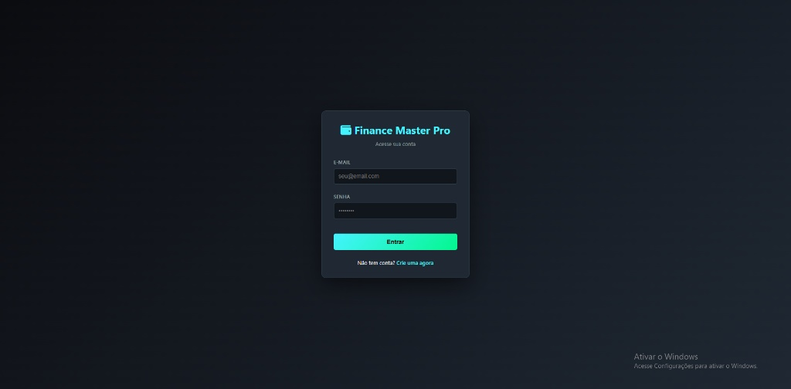
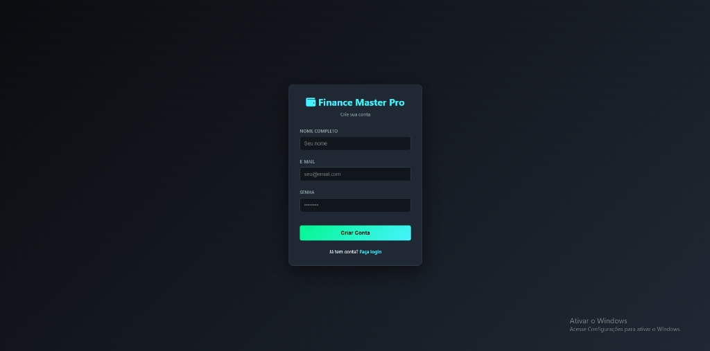
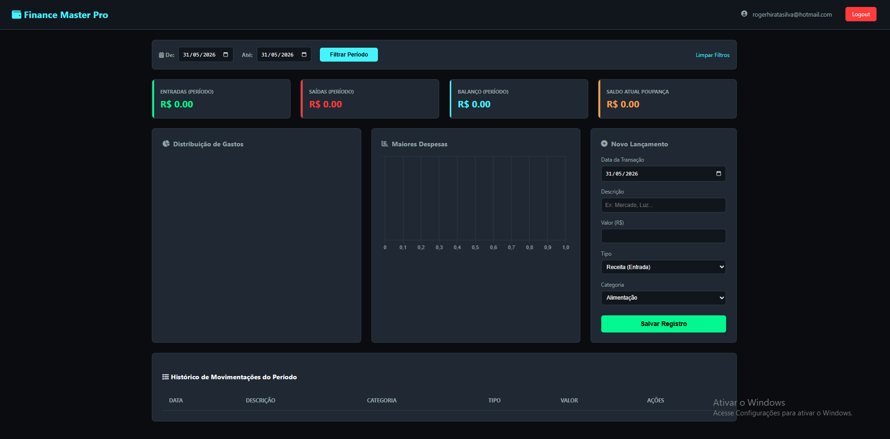

<!--
Finance Master Pro v2.0
README profissional para apresentação em GitHub
-->
# Finance Master Pro v2.0

> Finance Master Pro é um sistema de controle financeiro multi-usuário moderno, seguro e focado em privacidade dos dados. Desenvolvido como uma vitrine profissional para gerir transações pessoais e empresariais com visual agradável (Dark Mode), gráficos dinâmicos, e isolamento completo de dados por usuário.

---

## 🚀 Demonstração em Vídeo

Cole aqui o link do vídeo ou GIF que demonstra o fluxo principal: Login → Cadastro → Dashboard → Gráficos.

Exemplo de lugar para colar o link do YouTube ou o GIF hospedado:

**Link do vídeo / GIF:** [COLE_AQUI_O_LINK_DO_VIDEO_OU_GIF]

> Dica: Grave um GIF curto (10–30s) mostrando o login, criação de conta e a visualização do dashboard. Use ferramentas como ShareX, Loom ou a gravação do próprio YouTube.

---

## 📸 Capturas de Tela

Suba as imagens em `assets/screenshots/` e atualize os paths abaixo.

- **Tela de Login**

        

- **Tela de Cadastro**

        

- **Dashboard Principal**

        

Substitua os arquivos acima com prints reais antes de publicar no GitHub.

---

## Principais Funcionalidades

- Autenticação segura com JWT (JSON Web Tokens) e cookies `HttpOnly`
- Hash de senhas com `bcrypt` via `passlib`
- Multi-usuário com isolamento completo de dados por `usuario_id`
- CRUD de transações (criar/editar/deletar) com verificação de propriedade
- Gráficos dinâmicos com `Chart.js` para análise de receitas, despesas e saldo
- Filtros por período (diário, mensal, anual) e por categorias
- Proteção contra SQL Injection com queries parametrizadas
- Context manager para gerenciamento seguro de conexões com o banco
- Rotas protegidas e tratamento de sessão seguro

---

## Tecnologias Utilizadas

- Backend: `FastAPI`
- Banco de dados: SQL Server (acesso via `pyodbc`)
- Autenticação: `python-jose` (JWT), `passlib`, `bcrypt`
- Dependências Python: veja [requirements.txt](requirements.txt#L1)
- Frontend: HTML + CSS (Dark Mode), `Chart.js`, JavaScript
- Configuração: `.env` (base em [.env.example](.env.example#L1))

---

## Rodando o Projeto Localmente

Siga estes passos para executar o projeto localmente no Windows (desktop):

1. Clone o repositório:

```bash
git clone <SEU_REPOSITORIO_GIT_URL>
cd financeiroAcad
```

2. Crie um ambiente virtual e ative-o:

```bash
python -m venv .venv
.
```

No PowerShell:

```powershell
.\.venv\Scripts\Activate.ps1
```

No CMD:

```cmd
.\.venv\Scripts\activate.bat
```

3. Instale as dependências:

```bash
pip install -r requirements.txt
```

4. Configurar variáveis de ambiente

Copie o arquivo de exemplo e preencha com seus valores reais (especialmente `SECRET_KEY`):

```bash
copy .env.example .env
# editar .env com suas credenciais e dados do banco
```

5. Executar scripts de migração no SQL Server

Abra o arquivo de migração e execute no SQL Server Management Studio (SSMS):

- [MIGRACAO_BANCO_DADOS.sql](MIGRACAO_BANCO_DADOS.sql#L1)

O script cria a tabela `Usuarios`, adiciona a coluna `usuario_id` em `Transacoes` e aplica chaves estrangeiras e índices.

6. Ajuste a string de conexão no `.env` conforme sua instância SQL Server (veja `DB_SERVER` e `DB_DATABASE`).

7. Iniciar a aplicação:

```bash
uvicorn main:app --reload --host 0.0.0.0 --port 8000
```

8. Abra no navegador:

```
http://localhost:8000/login
```

---

## Recomendação para o GitHub (vitrine)

- Suba prints em `assets/screenshots/` e atualize o README com as imagens reais.
- Coloque o vídeo/GIF no YouTube (não listado) ou em `assets/demo/` e atualize o link na seção "Demonstração em Vídeo".
- Adicione um `LICENSE` se desejar compartilhar o código (MIT recomendado para portfólios).

---

## Segurança e Produção

- Nunca commit a sua `.env` com segredos. Use o `.gitignore` fornecido.
- Troque `SECRET_KEY` por uma chave forte e única antes de colocar em produção.
- Utilize HTTPS e configure um servidor reverso (Nginx/Traefik) para produção.

---

## Contato

Autor: Seu Nome — use o repositório como vitrine para apresentar ao professor.

Se precisar, posso gerar um commit pronto e os comandos para enviar ao GitHub.

---

Obrigado por usar o Finance Master Pro v2.0 — pronto para impressionar seu professor!
# Finance Master Pro - Refatoração para Produção

## 📋 Resumo das Melhorias Implementadas

Este documento descreve todas as melhorias implementadas no backend FastAPI do Finance Master Pro para padrão profissional de produção.

---

## 1. Sistema de Autenticação Completo ✅

### ✨ Funcionalidades Implementadas

- **Rotas de Login e Cadastro**
  - `GET /login` - Página de login com formulário
  - `POST /web/login` - Processa autenticação
  - `GET /cadastro` - Página de cadastro
  - `POST /web/cadastro` - Processa registro de novo usuário
  - `GET /logout` - Realiza logout e limpa cookie

- **Segurança de Senhas**
  - Hashing com **bcrypt** via `passlib`
  - Funções: `hash_password()` e `verify_password()`
  - Validação de comprimento mínimo (6 caracteres)

- **Gerenciamento de Sessões**
  - Tokens **JWT** com expiração de 24 horas
  - Cookies seguros (`httponly=True`)
  - Função `create_access_token()` e `verify_token()`

- **Interface Visual**
  - Páginas de login/cadastro com identidade visual **Dark Mode**
  - Mensagens de erro/sucesso dinâmicas
  - Responsivo e profissional

---

## 2. Multi-Usuário com Isolamento de Dados ✅

### 🔒 Segurança de Dados Implementada

**Todas as operações agora incluem filtro `WHERE usuario_id = ?`:**

1. **Dashboard Principal**
   - Resumo Financeiro: Apenas dados do usuário
   - Gráficos: Filtragem por usuário
   - Histórico de Transações: Isolado por usuário

2. **CRUD de Transações**
   - `POST /web/salvar`: Insere/atualiza com `usuario_id`
   - `GET /web/deletar/{id}`: Verifica propriedade antes de deletar
   - Todas as queries incluem `usuario_id` no WHERE

3. **Tabela Usuarios**
   - Armazena: `id`, `email`, `senha_hash`, `nome`, `data_criacao`, `ativo`
   - Chave única em `email`
   - Relacionamento com `Transacoes` via Foreign Key

### Queries Seguras (Exemplos)

```sql
-- Receitas do período (apenas do usuário)
SELECT SUM(t.valor) 
FROM Transacoes t
JOIN Categorias c ON t.categoria_id = c.id
WHERE t.tipo = 'Receita' 
  AND t.data_transacao BETWEEN ? AND ?
  AND t.usuario_id = ?  -- ✅ ISOLAMENTO POR USUÁRIO
```

---

## 3. Boas Práticas e Robustez ✅

### 🛡️ Context Manager para BD

```python
@contextmanager
def get_db_connection():
    """Context manager para garantir fechamento seguro da conexão"""
    conn = None
    try:
        conn = pyodbc.connect(CONN_STR)
        yield conn
    except Exception as e:
        if conn:
            conn.rollback()
        raise e
    finally:
        if conn:
            conn.close()
```

**Benefícios:**
- ✅ Conexões fechadas mesmo com exceções
- ✅ Rollback automático em caso de erro
- ✅ Uso com `with` statement (seguro)
- ✅ Zero vazamento de recursos

**Uso nas rotas:**
```python
with get_db_connection() as conn:
    cursor = conn.cursor()
    # Operações...
    conn.commit()
# Conexão fechada automaticamente
```

### 🔐 Autenticação em Todas as Rotas Protegidas

Cada rota protegida valida o token:
```python
def dashboard_executivo(
    edit_id: int = None,
    data_inicio: str = None,
    data_fim: str = None,
    token: Optional[str] = Cookie(None)  # ✅ REQUER TOKEN
):
    if not token:
        return RedirectResponse(url="/login", status_code=303)
    
    try:
        email = verify_token(token)
        usuario_id = get_usuario_id_by_email(email)
    except HTTPException:
        return RedirectResponse(url="/login", status_code=303)
```

---

## 4. Estrutura de Arquivos

```
c:\Users\ROGER\Desktop\financeiroAcad\
├── main.py                          # ✅ Código refatorado
├── requirements.txt                 # ✅ Dependências atualizadas
├── MIGRACAO_BANCO_DADOS.sql        # ✅ Script SQL para BD
└── README.md                        # Este arquivo
```

---

## 5. Dependências Instaladas

Adicionar ao `requirements.txt`:

```
fastapi==0.136.1
uvicorn==0.47.0
pyodbc==5.3.0
pydantic==2.13.4
python-multipart==0.0.29

# ✅ NOVAS DEPENDÊNCIAS
passlib==1.7.4           # Hashing de senhas
bcrypt==4.1.2            # Algoritmo bcrypt
python-jose==3.3.0       # JWT tokens
cryptography==42.0.2     # Suporte criptográfico
```

**Instalar:**
```bash
pip install -r requirements.txt
```

---

## 6. Preparação do Banco de Dados

### Executar Migrations SQL

1. Abra **SQL Server Management Studio**
2. Conecte ao servidor `DESKTOP-JBCNUT6\SQL_ROGER`
3. Execute o script `MIGRACAO_BANCO_DADOS.sql`

**O script criará:**
- ✅ Tabela `Usuarios` com colunas de autenticação
- ✅ Coluna `usuario_id` em `Transacoes`
- ✅ Foreign Key e índices para performance

---

## 7. Como Executar

### Iniciar o servidor:

```bash
# Ativar ambiente virtual (se houver)
# venv\Scripts\activate

# Instalar dependências
pip install -r requirements.txt

# Rodar servidor
uvicorn main:app --reload --host 127.0.0.1 --port 8000
```

### Acessar a aplicação:

```
http://localhost:8000/login
```

### Primeiro acesso:
1. Crie uma conta em `/cadastro`
2. Faça login com suas credenciais
3. Acesse o dashboard em `/`

---

## 8. Fluxo de Autenticação

```
[Usuário não autenticado]
        ↓
[Tenta acessar /]
        ↓
[Redireciona para /login]
        ↓
[POST /web/login com email + senha]
        ↓
[Valida credenciais no BD]
        ↓
[Cria JWT token (24h)]
        ↓
[Define cookie httponly com token]
        ↓
[Redireciona para /]
        ↓
[Dashboard acessa token do cookie]
        ↓
[Verifica JWT e recupera usuario_id]
        ↓
[Todas as queries usam usuario_id]
        ↓
✅ [Dados isolados por usuário]
```

---

## 9. Segurança Implementada

| Recurso | Implementação | Status |
|---------|--------------|--------|
| Hashing de Senhas | bcrypt (passlib) | ✅ |
| Tokens JWT | 24h de expiração | ✅ |
| Cookies Seguros | httponly=True | ✅ |
| Isolamento de Dados | usuario_id em todas as queries | ✅ |
| Context Manager BD | try/finally + rollback | ✅ |
| Validação de Propriedade | Verifica usuario_id antes de CRUD | ✅ |
| Proteção de Rotas | Requer token JWT válido | ✅ |

---

## 10. Mudanças nas Queries SQL

### Antes (Sem Segurança)
```sql
SELECT * FROM Transacoes WHERE data_transacao BETWEEN ? AND ?
```

### Depois (Com Isolamento)
```sql
SELECT * FROM Transacoes 
WHERE data_transacao BETWEEN ? AND ?
  AND usuario_id = ?
```

**Aplicado em:**
- Resumo de receitas/despesas
- Gráficos (rosca e ranking)
- Histórico de transações
- Busca para edição
- Deleção com validação

---

## 11. Logout e Limpeza de Sessão

```python
@app.get("/logout")
def logout():
    """Faz logout do usuário"""
    response = RedirectResponse(url="/login", status_code=303)
    response.delete_cookie(key="token")
    return response
```

- ✅ Deleta cookie do token
- ✅ Redireciona para login
- ✅ Sesião encerrada

---

## 12. Próximos Passos Recomendados (Opcional)

Para escalar em produção:

- [ ] Mover `SECRET_KEY` para variável de ambiente
- [ ] Usar HTTPS em produção
- [ ] Implementar rate limiting em login
- [ ] Adicionar 2FA (autenticação de dois fatores)
- [ ] Logs de auditoria (quem fez o quê)
- [ ] Backup automático do BD
- [ ] Monitoramento e alertas
- [ ] Cache (Redis) para queries frequentes

---

## 13. Teste de Funcionalidade

### Verificar isolamento de dados:

1. **Usuário 1 (teste@email.com)**
   - Login
   - Criar transação "Mercado - R$ 100"
   - Logout

2. **Usuário 2 (outro@email.com)**
   - Login
   - Criar transação "Restaurante - R$ 50"
   - Verificar que vê apenas sua transação

3. **Tentar acesso direto**
   - Editar URL: `/?edit_id=1` (de outro usuário)
   - Resultado: Redireciona sem permitir edição ✅

---

## 14. Troubleshooting

### "Token expirado ou inválido"
- Cookie pode ter expirado (24h)
- Faça logout e login novamente

### "Email já cadastrado"
- Use outro email ou faça login se já existe conta

### "Email ou senha inválidos"
- Verifique credenciais
- Use email registrado

### Erro de conexão com BD
- Verifique `CONN_STR` em `main.py`
- Confirme que SQL Server está rodando

---

## 📞 Suporte

Para dúvidas sobre a implementação:
- Revise o código em `main.py` (comentários explicativos)
- Consulte a documentação do FastAPI: https://fastapi.tiangolo.com/
- Documentação JWT: https://python-jose.readthedocs.io/

---

**Refatoração concluída: ✅**
- ✅ Autenticação segura
- ✅ Multi-usuário com isolamento
- ✅ Boas práticas profissionais
- ✅ Context manager para BD
- ✅ Interface mantida intacta

**Versão: 2.0 - Production Ready**
